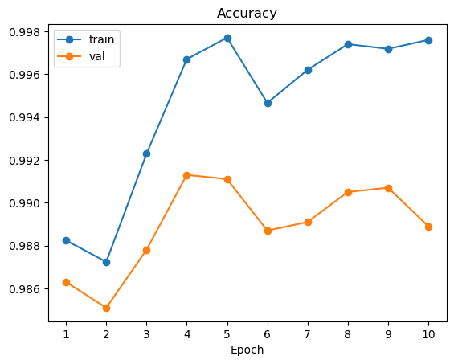
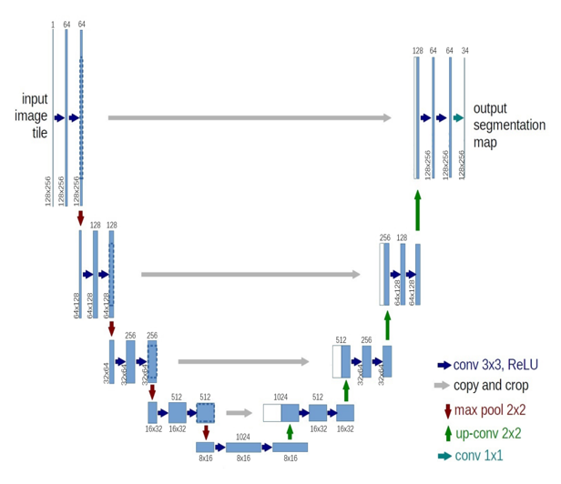
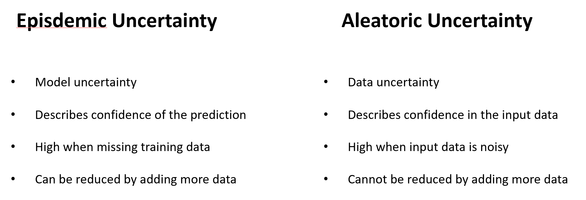
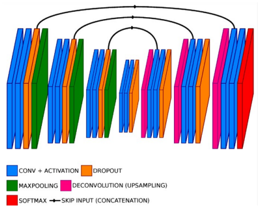
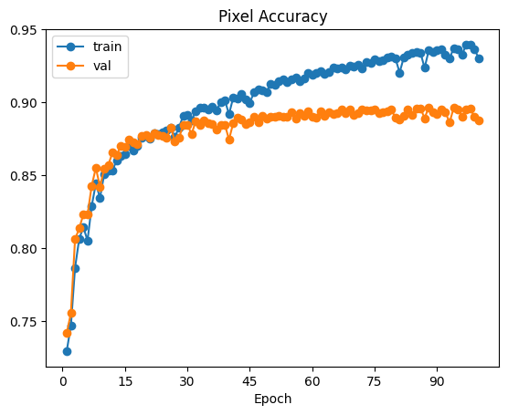
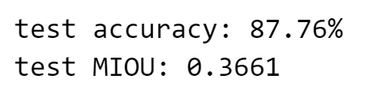
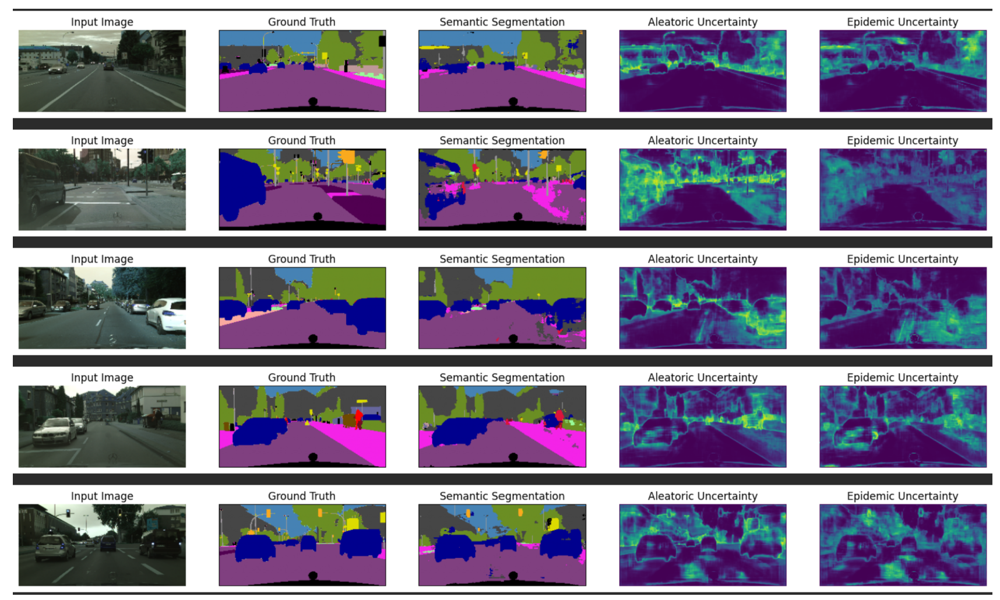

# 2023-Winter-Frontier-Research-Program

## Deep Learning in Computer Vision
If you find my project useful, don't hesitate to give it a star.
 
### Part 1: Digit recognition on MNIST
Architecture of my model:
- [conv-relu-pool]x3 -> [affine]x1 -> softmax
1. Convolutional layer (with bias) with 24 5x5 filters, with zero-padding of 2, with stride of 1
2. ReLU
3. pooling layer with window size of 2x2, with stride of 2, without padding
4. Convolutional layer (with bias) with 48 5x5 filters, with zero-padding of 2, with stride of 1
5. ReLU
6. pooling layer with window size of 2x2, with stride of 2, without padding
7. Convolutional layer (with bias) with 64 5x5 filters, with zero-padding of 2, with stride of 1
8. ReLU
9. pooling layer with window size of 2x2, with stride of 2, without padding
10. Fully-connected layer (with bias) to compute scores for 10 classes

Training and validation accuracy:

Test: 99.15%

### Part 2: Semantic Segmentation and Uncertainty Estimation on CityScapes
- Used PyTorch to build a semantic segmentation pipeline for autonomous driving based on [U-Net](https://arxiv.org/abs/1505.04597).
  

- Estimated aleatoric and epistemic uncertainty in my model and its predictions.
  
  **Key Idea**: Do dropout at both training and testing time. At test time, repeat prediction a few hundreds times with random dropout. The variance of predictions gives the episdemic uncertainty of the model.
   
  **Reference**: [Uncertainty in Deep Learning. How To Measure?](https://towardsdatascience.com/my-deep-learning-model-says-sorry-i-dont-know-the-answer-that-s-absolutely-ok-50ffa562cb0b)

  After adding dropout layers: **Bayesian U-Net**
  
  

  **Results**
  
  
  